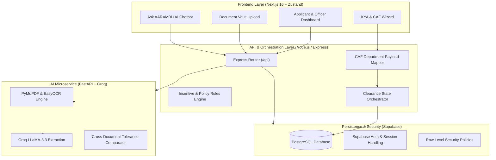

<!-- ===================================================================== -->
<!-- 🌐 LIVE DEPLOYMENT URL (Add your deployed production link below)     -->
<!-- Example: # 👉 Live link: https://your-deployment-url.vercel.app/      -->
<!-- ===================================================================== -->
# 👉 Live link: `https://aarambh-industrial-portal.vercel.app/`

<!-- ===================================================================== -->
<!-- 🎥 DEMO VIDEO / WALKTHROUGH (Add your video presentation link below)  -->
<!-- Example: # 📺 Video Demo: https://youtu.be/your_video_id              -->
<!-- ===================================================================== -->
> **📺 Demo Video Walkthrough**: `[ADD_DEMO_VIDEO_LINK_HERE]`

---

# 🚀 AARAMBH – AI-Powered Smart Single Window Industrial Clearance Engine

**A single window that actually thinks — not just files paperwork.**

**AARAMBH** is an intelligent, automated single-window clearance and compliance platform engineered for Maharashtra's industrial ecosystem. Built for **Smart India Hackathon 2026 (Problem Statement 26130)** for the **Government of Maharashtra, Maharashtra State Innovation Society (Dept. of Skills, Employment, Entrepreneurship & Innovation)**.

The system combines **Fast LLM Inference (Groq)**, **Document Vision/OCR (PyMuPDF & EasyOCR)**, **Rule Engines (Incentives & Dynamic Policies)**, and a **Directed Acyclic Graph (DAG) Dependency Orchestrator** to eliminate cross-department bottlenecks, catch document discrepancies before officer review, and auto-unlock downstream statutory clearances.

---

## 🎯 Goals
- **Eliminate Application Bounces**: Automatically cross-validate uploaded deeds, blueprints, and forms with multi-document tolerance checks before human submission.
- **Dynamic Dependency Unlocking**: Model clearance pipelines as an active DAG where prerequisite approvals (e.g., MIDC Land Allotment) instantly unlock downstream clearances (MPCB Consent, Fire NOC, DISH).
- **Zero Redundant Data Entry**: Auto-extract statutory parameters (plot size, connected load, capital investment, PAN/GSTIN) and auto-fill unified Common Application Forms (CAF).
- **Enforce Statutory SLAs**: Real-time SLA tracking with multi-tier automated escalation workflows for pending departmental approvals.
- **Democratize Incentive Access**: Instant calculation and policy eligibility mapping based on the Maharashtra Industrial Policy (PPSI, mega-project capex tiers, and backward taluka incentives).

---

## 🌟 Core Features

- 🔍 **KYA (Know Your Approvals) Wizard** → Dynamic sector, land, and scale-based clearance discovery engine.
- 📁 **Intelligent Document Vault & OCR** → Real-time multi-format document extraction powered by Groq and PyMuPDF/EasyOCR.
- 🛡️ **Pre-Validation Gatekeeper** → Live cross-document parameter verification & mismatch detection before file submission.
- 🕸️ **Approval Dependency Engine (DAG)** → Real-time clearance dependency graph that automatically unlocks dependent permits as prerequisites clear.
- 📝 **Unified Common Application Form (CAF)** → Fill once, automatically map and serialize payload schemas across all state departments (MIDC, MPCB, Fire, Water, Power, Labor).
- ⏱️ **Statutory SLA & Escalation Tracker** → Transparent state-driven timeline monitor with automatic tier escalations for delayed clearances.
- 💰 **Policy & Incentive Calculator** → Rules engine computing capital subsidies, power tariff concessions, stamp duty exemptions, and GST incentives under Maharashtra Industrial Policy.
- 🤖 **Ask AARAMBH Regulatory Copilot** → Fast conversational assistant answering statutory compliance queries and policy eligibility.
- 🧑‍💼 **Officer Workspace & Inspection Planner** → Unified portal for department officers with risk scoring, review queues, and joint inspection scheduling.

---

## 🏗 Tech Stack

**Frontend:**
- **Framework**: Next.js 16 (App Router), React 19, TypeScript
- **Styling**: Tailwind CSS v4, Framer Motion
- **State Management**: Zustand
- **Icons & UI**: Lucide React, Modern Glassmorphic Component System

**Backend & Microservices:**
- **API Orchestrator**: Node.js, Express, TypeScript
- **AI Microservice**: Python, FastAPI, Uvicorn
- **AI/ML & Extraction**: Groq Cloud SDK (`llama-3.3-70b-versatile`), PyMuPDF, EasyOCR, Pydantic

**Database & Auth:**
- **Database**: PostgreSQL via Supabase
- **Authentication**: Supabase Auth (Email OTP, Magic Link, Session Management) & Row Level Security (RLS)
- **Migrations**: Declarative SQL migrations with audit hardening and enterprise schema tracking

**Infra & Tooling:**
- **Dev Tooling**: Single-command orchestrator (`start-all.ps1` / `start-all.sh`), ts-node-dev
- **PDF Generation & Testing**: Node scripts, automated email OTP and endpoint test suites

---

## 📂 Repository Structure

```text
AARAMBH/
│── frontend/                          # Next.js 16 Web Application
│   ├── src/
│   │   ├── app/
│   │   │   ├── page.tsx               # High-converting interactive landing page
│   │   │   ├── apply/                 # Searchable clearances & approvals directory
│   │   │   ├── login/, signup/        # Supabase authentication & OTP flows
│   │   │   ├── reset-password/        # Password recovery & auth callback handler
│   │   │   ├── track/                 # Public application status tracker
│   │   │   ├── dashboard/             # Enterprise applicant dashboard
│   │   │   │   ├── kya/               # Know Your Approvals wizard
│   │   │   │   ├── caf/               # Unified Common Application Form
│   │   │   │   ├── vault/             # Smart Document Vault + AI extraction
│   │   │   │   ├── prevalidation/     # Discrepancy & tolerance gatekeeper
│   │   │   │   ├── dag/               # Visual DAG clearance dependency canvas
│   │   │   │   ├── sla/               # Statutory SLA tracking & escalations
│   │   │   │   ├── officer-workspace/ # Department officer scrutiny queue
│   │   │   │   ├── inspections/       # Joint site inspection coordination
│   │   │   │   ├── grievances/        # Direct dispute & grievance desk
│   │   │   │   └── profile/           # Enterprise profile & master data
│   │   │   └── api/chat/route.ts      # Server-side Groq chatbot proxy
│   │   ├── store/                     # Zustand state (enterpriseStore, authContext)
│   │   └── utils/supabase/            # Supabase SSR & client instances
│   └── package.json
│
│── backend/                           # Node.js + Express API Layer
│   ├── src/
│   │   ├── index.ts                   # Core API routes & clearance pipeline handlers
│   │   ├── db.ts                      # Database access & helper queries
│   │   ├── supabase.ts                # Supabase admin client
│   │   ├── caf/                       # Department-specific form mappers
│   │   └── rules/                     # Policy incentive & workflow rules engines
│   └── package.json
│
│── ai-service/                        # Python FastAPI OCR & Extraction Microservice
│   ├── main.py                        # Document extraction & Groq processing endpoints
│   └── requirements.txt
│
│── supabase/
│   └── migrations/                    # Database schemas, RLS policies, audit logs
│
│── scripts/
│   ├── start-all.ps1                  # Windows one-command startup script
│   ├── start-all.sh                   # Unix/Linux one-command startup script
│   └── tests/                         # Integration test scripts & demo sample PDF
│       ├── test-email-otp.js          # Supabase Email OTP integration test
│       ├── test-persistence-endpoints.js # Backend REST & DAG cascade test
│       ├── test-vault-extract.js      # OCR & AI extraction test
│       ├── generate-sample-pdf.js     # Statutory test PDF generator
│       └── sample-dossier.pdf         # Demo statutory PDF file
│
│── .env.example                       # Reference environment configuration
└── README.md                          # Project documentation
```

---

## ⚡ Quick Start

### Option A: One-Command Launch (Recommended)

```powershell
# Windows (PowerShell)
.\scripts\start-all.ps1
```

```bash
# macOS / Linux
chmod +x ./scripts/start-all.sh
./scripts/start-all.sh
```

---

### Option B: Manual Service-by-Service Setup

#### 1. AI Extraction Microservice (Python)
```bash
cd ai-service
python -m pip install -r requirements.txt
python -m uvicorn main:app --port 8000 --reload
```

#### 2. Backend Orchestration API (Node.js)
```bash
cd backend
npm install
npm run dev
```

#### 3. Frontend Web Application (Next.js)
```bash
cd frontend
npm install
npm run dev
```

Once running, navigate to **`http://localhost:3000`** in your browser.

---

## ⚙️ Environment Configuration

Create the respective `.env` files in each service directory using the examples below:

### `frontend/.env.local`
```env
NEXT_PUBLIC_SUPABASE_URL=your_supabase_project_url
NEXT_PUBLIC_SUPABASE_ANON_KEY=your_supabase_anon_key
GROQ_API_KEY=your_groq_api_key
```

### `backend/.env`
```env
PORT=5000
SUPABASE_URL=your_supabase_project_url
SUPABASE_ANON_KEY=your_supabase_anon_key
SUPABASE_SERVICE_ROLE_KEY=your_supabase_service_role_key
GROQ_API_KEY=your_groq_api_key
AI_SERVICE_URL=http://localhost:8000
```

### `ai-service/.env`
```env
GROQ_API_KEY=your_groq_api_key
PORT=8000
```

---

## 📊 System Architecture & Data Flow



---

## 👥 Team & Acknowledgements

**Team HellFire Club**  
- **Hackathon**: Smart India Hackathon 2026
- **Problem Statement**: PS 26130 – Unified Single Window Industrial Clearance System
- **Organization**: Government of Maharashtra · Maharashtra State Innovation Society (Dept. of Skills, Employment, Entrepreneurship & Innovation)

### 🌟 Team Members

| Name | Role / Focus Areas |
|---|---|
| **Viraj Kumar Vishwakarma** | **Team Leader** · Frontend / Research |
| **Aanya Jain** | Backend / Database / PPT |
| **Manya Arora** | Backend / Database |
| **Srishti Shrivastava** | Frontend |
| **Avni Sharma** | Research / PPT |

---
