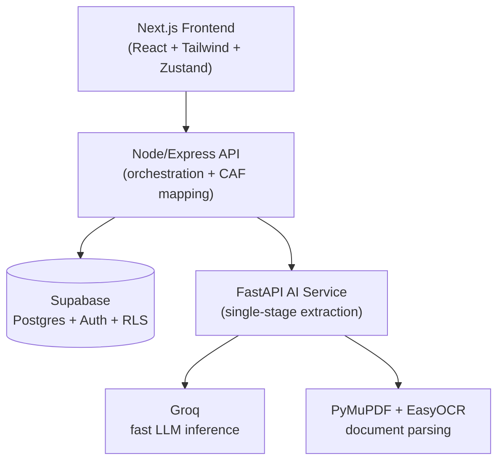

# AARAMBH

**A single window that actually thinks — not just files paperwork.**

Built for Smart India Hackathon 2026 · Problem Statement 26130 · Government of Maharashtra, Maharashtra State Innovation Society (Dept. of Skills, Employment, Entrepreneurship & Innovation)

---

## The problem we're actually solving

If you've ever tried to start an industrial unit in Maharashtra, you already know the pain: MIDC land allotment here, MPCB pollution consent there, a Fire NOC from a completely different office, a water connection from yet another department — each with its own portal, its own document requirements, and its own timeline that nobody tells you until you've already missed it.

That's not a hypothetical. It's the literal problem statement we were handed (PS 26130): entrepreneurs struggle to even *identify* which approvals they need, departments deal with incomplete applications and repeat scrutiny, and nobody — not the applicant, not the officer — has real visibility into where things are stuck.

Existing portals like NSWS and MAITRI have made real progress here — they already let departments process applications in parallel, and MAITRI 2.0 even ships an incentive calculator. We checked, because we didn't want to pitch a "difference" that wasn't actually true. But both are still fundamentally *passive*: you upload a document, and then you wait for a human to notice if something's wrong. Neither auto-detects a mismatch between two of your own uploaded documents before you submit. Neither automatically unlocks a downstream approval the moment its prerequisite clears.

AARAMBH is our attempt to close that specific gap: an approval system that reads your documents, checks them against each other, and actively moves your file forward — instead of just storing it.

---

## What actually makes this different

Three things here are genuinely structural, not cosmetic:

### 1. It catches your mistakes before a human ever sees them
Upload your land lease deed and your site blueprint separately, and if the plot area on one says 10,000 sq.m and the other says 9,500 sq.m, AARAMBH flags it immediately and locks submission — instead of an officer discovering the discrepancy three weeks later and bouncing the whole file back to square one.

### 2. Approvals unlock each other automatically
We modeled approvals as an actual dependency graph, not a flat list. The moment your Land Allotment gets approved, every clearance that depended on it — Pollution Consent, Fire NOC, Water Allocation — flips from locked to active on its own, live.

### 3. It reads your documents instead of asking you to retype them
The Document Vault and our Common Application Form (CAF) system extract real fields out of your uploaded documents — plot area, power load, PAN, GSTIN — and reuse them across every department's form, tagging each field with exactly where it came from.

Underneath all three sits the same idea: **stop treating single-window systems like a filing cabinet, and start treating them like a system that's actually paying attention.**

---

## What's genuinely working right now

We'd rather tell you exactly where things stand than let a demo surprise us. Here's the honest state of every major piece, as of this build:

| Feature | Status |
|---|---|
| KYA Wizard (customised checklist generation) | ✅ Fully working — real rule engine, not a static list |
| Approvals Directory (`/apply`) | ✅ Fully working — searchable, filterable directory of every clearance type |
| Document Vault + AI extraction | ✅ Fully working — real Groq + PyMuPDF/EasyOCR pipeline, with a graceful fallback if the AI service is briefly unreachable |
| Unified Common Application Form (CAF) | ✅ Fully working — fill once, map to every department's schema |
| Pre-Validation Gatekeeper | ✅ Fully working — real cross-document percentage-tolerance comparison |
| Dependency Graph (DAG) approval engine | ✅ Fully working — real multi-parent dependency state, not an animation |
| SLA Tracker with escalation tiers | ✅ Fully working — real state-driven thresholds and colour transitions |
| Policy & Incentive Rules Engine | ✅ Fully working — genuinely sophisticated: capex tiers, special-region overrides, sector-specific policy exceptions |
| Ask AARAMBH chatbot | ✅ Working — real Groq-backed, conversational, accurate on statutory facts |
| Officer Workspace | ⚠️ Working, but risk track doesn't yet filter/sort the queue operationally |
| Joint Inspection Scheduling | ⚠️ UI built, spatial clustering logic not yet wired |
| Renewals | ⚠️ Present as a data field, not yet a full tracked workflow |
| Grievance Desk | ⚠️ UI built, not yet persisted to the database |
| Regulatory Copilot (RAG-grounded) | ⚠️ Chatbot is a well-prompted Groq assistant right now — not yet grounded in a retrieved document corpus |
| Delay analytics dashboard | 🔜 Not yet built |

We're listing the partial and not-yet-built items on purpose. A judge who tests something we claimed was finished and finds it isn't costs us more credibility than one honest line in a README ever will.

---

## Architecture — how the pieces actually talk to each other



A quick, honest note on this diagram: our original planning docs described a LangGraph-orchestrated, ChromaDB-backed multi-stage AI pipeline. What's actually running is simpler — a single Groq completion call per document, with PyMuPDF/EasyOCR doing the text extraction beforehand. It's a real, working integration; it's just not the more elaborate version we originally sketched, and we'd rather say that plainly than have the gap discovered mid-demo.

### Why these specific technologies

- **Groq** for LLM inference — a live demo dying on an 8-second API response is a self-inflicted wound. Groq's inference speed keeps the pre-validation check and auto-fill feeling instant.
- **Supabase** — Postgres with real Auth and Row Level Security built in, so we didn't have to hand-roll session management or access control from scratch.
- **FastAPI, kept isolated from the Node backend** — so the AI workload can scale independently from user traffic, and the backend degrades gracefully (via a regex/heuristic fallback) if the AI service is briefly unreachable.
- **Zustand** on the frontend — lightweight shared state so a change in the Vault instantly reflects in Pre-Validation and the CAF, without prop-drilling or a heavier state library.

---

## Project structure

```text
aarambh/
  frontend/                Next.js (App Router) + TypeScript + Tailwind
    src/app/
      page.tsx              Public landing page
      apply/                 Approvals Directory (searchable/filterable)
      login/, signin/, signup/   Auth screens
      api/chat/route.ts      Ask AARAMBH chatbot (server-side Groq call)
      dashboard/
        kya/                  KYA Wizard
        caf/                  Unified Common Application Form
        vault/                Document Vault + AI auto-fill
        prevalidation/        Mismatch detection & lock
        dag/                  Dependency graph canvas
        sla/                  SLA tracker
        inspections/          Joint Inspection scheduling (UI stage)
        grievances/           Grievance Desk (UI stage)
        officer-workspace/    Officer review queue
        department-approvals/ Department-grouped clearance view
        profile/              Business profile management
    src/store/              Zustand shared state
    src/lib/                Supabase browser client
    src/data/               Approvals registry, static reference data

  backend/                  Node.js + Express (API layer)
    src/
      index.ts               Main API routes
      supabase.ts             Server-side Supabase client
      caf/                    Common Application Form schema + department mappers
      rules/                  Policy incentive engine + workflow rule engine

  ai-service/                Python FastAPI microservice
    main.py                   Document extraction endpoint (PyMuPDF/EasyOCR/Groq)

  supabase/
    migrations/               SQL schema (three migrations, including a schema fix)

  docs/                      PRD, technical spec, schema docs
  .env.example
  README.md                  you are here
```

---

## Running this locally

You'll need three things running **at the same time**, each in its own terminal.

**1. The AI service (Python)**
```bash
cd ai-service
python -m pip install -r requirements.txt
python -m uvicorn main:app --reload
```

**2. The backend (Node)**
```bash
cd backend
npm install
npm run dev
```

**3. The frontend (Next.js)**
```bash
cd frontend
npm install
npm run dev
```

Then open **http://localhost:3000**.

### Environment setup

**In `frontend/.env.local`:**
```env
NEXT_PUBLIC_SUPABASE_URL=
NEXT_PUBLIC_SUPABASE_ANON_KEY=
GROQ_API_KEY=
```

**In `backend/.env`:**
```env
SUPABASE_URL=
SUPABASE_ANON_KEY=
SUPABASE_SERVICE_ROLE_KEY=
GROQ_API_KEY=
AI_SERVICE_URL=http://localhost:8000
```

**In `ai-service/.env`:**
```env
GROQ_API_KEY=
```

None of these are committed to the repo — if you're cloning this fresh, you'll need your own keys.

### Setting up the database

Run the three migration files in `supabase/migrations/` against your own Supabase project, in order, via the SQL Editor in your Supabase dashboard. The third migration file exists specifically to correct a schema type mismatch we hit during development (`enterprise_id` inconsistently typed as `TEXT` vs `UUID` across two earlier migrations) — it supersedes the conflicting parts of the first two.

---

## What's mocked or simulated right now, and why that's okay

- **DigiLocker/Aadhaar login** is currently a simulated flow — real integration requires formal government "Requester" partner registration, which involves an organizational onboarding process well beyond a hackathon timeline. Normal email/password signup runs on real Supabase Auth.
- **The AI document extraction** genuinely calls Groq and runs real OCR — it's a single-stage pipeline (not the multi-agent LangGraph/RAG system in our original architecture sketch), tuned against the sample document formats we tested with.
- **Inspection scheduling, renewals, the RAG-grounded regulatory copilot, and delay analytics** are either partially built (UI without the underlying logic) or not yet started — see the status table above for the exact state of each.

---

## Team

**Team HELLFIRE CLUB** · Smart India Hackathon 2026 · PS 26130

---
