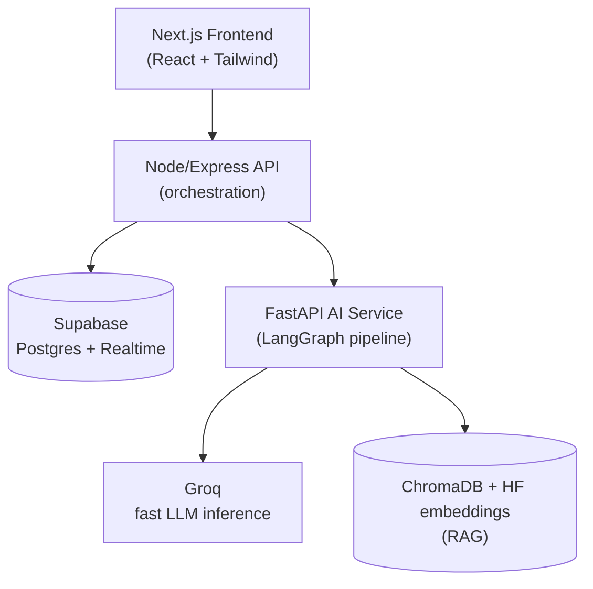

# AARAMBH

**A single window that actually thinks - not just files paperwork.**

Built for Smart India Hackathon 2026 · Problem Statement 26130 · Government of Maharashtra, Maharashtra State Innovation Society (Dept. of Skills, Employment, Entrepreneurship & Innovation)

---

## The problem we're actually solving

If you've ever tried to start an industrial unit in Maharashtra, you already know the pain: MIDC land allotment here, MPCB pollution consent there, a Fire NOC from a completely different office, a water connection from yet another department — each with its own portal, its own document requirements, and its own timeline that nobody tells you until you've already missed it.

That's not a hypothetical. It's the literal problem statement we were handed (PS 26130): entrepreneurs struggle to even *identify* which approvals they need, departments deal with incomplete applications and repeat scrutiny, and nobody — not the applicant, not the officer — has real visibility into where things are stuck.

Existing portals like NSWS and MAITRI have made real progress here — they already let departments process applications in parallel, and MAITRI 2.0 even ships an incentive calculator. We checked. But both are still fundamentally *passive*: you upload a document, and then you wait for a human to notice if something's wrong. Neither auto-detects a mismatch between two of your own uploaded documents before you submit. Neither automatically unlocks a downstream approval the moment its prerequisite clears — you're expected to know that, or hope your inbox notification does its job.

AARAMBH is our attempt to close that specific gap: an approval system that reads your documents, checks them against each other, and actively moves your file forward — instead of just storing it.

---

## What actually makes this different

We didn't want to just build "NSWS with nicer colors." Three things in here are genuinely structural, not cosmetic:

### 1. It catches your mistakes before a human ever sees them
Upload your land lease deed and your site blueprint separately, and if the plot area on one says 10,000 sq.m and the other says 9,500 sq.m, AARAMBH flags it immediately and locks submission — instead of an officer discovering the discrepancy three weeks later and bouncing the whole file back to square one. This is the feature we'd want a judge to watch first.

### 2. Approvals unlock each other automatically
Most systems track approvals as a flat list — everything just sits "in progress" until someone manually checks and notifies the next department. We modeled it as an actual dependency graph. The moment your Land Allotment gets approved, every clearance that depended on it — Pollution Consent, Fire NOC, Water Allocation — flips from locked to active on its own, live, with no email chain involved.

### 3. It reads your documents instead of asking you to retype them
The AI Vault doesn't just store your PDFs — it actually extracts the fields (plot area, power load, PAN, GSTIN) out of them and pre-fills your forms, tagging every field with exactly where it came from (verified via DigiLocker, or AI-extracted) so nothing is a black box.

Underneath all three of these sits the same idea: **stop treating single-window systems like a filing cabinet, and start treating them like a system that's actually paying attention.**

---

## Feature map — what's built, and how it maps back to the PS

| PS 26130 asks for... | We built... | Status |
|---|---|---|
| Customised approval checklist | KYA Wizard — generates a checklist + risk track from project inputs | ✅ Working |
| Reuse verified data / pre-validate submissions | Document Vault + AI auto-fill + Pre-Validation Gatekeeper | ✅ Working |
| Parallel departmental workflows | Dependency Graph (DAG) engine with auto-unblocking | ✅ Working |
| SLA tracking + alerts | SLA Tracker with escalation tiers (75/90/100%) | ✅ Working |
| Single dashboard | Investor Dashboard with KPIs + quick actions | ✅ Working |
| Common inspection scheduling | Spatial Joint Inspection Planner | 🔜 Designed, not yet built |
| Regulatory knowledge engine | RAG-based Regulatory Copilot over Acts/Gazettes | 🔜 Designed, not yet built |
| Grievance escalation | Grievance Desk with its own resolution SLA | 🔜 Designed, not yet built |
| Delay analytics | Officer-side bottleneck dashboard | 🔜 Designed, not yet built |

We're being upfront about what's mocked vs. real — we'd rather a judge trust three working features than doubt ten described ones.

---

## Architecture — how the pieces actually talk to each other



We kept the AI service completely separate from the main backend on purpose — it means the document-extraction pipeline can be scaled or swapped out independently, instead of dragging down the rest of the app if it gets busy.

### Why these specific technologies

- **Groq** for LLM inference — because a live demo dying on an 8-second API response is a self-inflicted wound. Groq's inference speed keeps the pre-validation check and auto-fill feeling instant, even in front of a judging panel.
- **LangGraph** — so the document pipeline (ingest → extract → validate → route) is an actual inspectable multi-step process, not a single opaque prompt call pretending to be "AI."
- **Supabase** — Postgres with Realtime built in, so the DAG canvas and SLA meters can update live without us hand-rolling a polling system.
- **FastAPI, kept isolated from the Node backend** — because a real deployment would need the AI workload to scale independently from user traffic, and we wanted the architecture to reflect that from day one, not bolt it on later.

---

## Project structure

```text
aarambh/
  frontend/                Next.js 15 (App Router) + TypeScript + Tailwind
    app/
      page.tsx              Public landing page
      login/                 Auth screens
      dashboard/
        kya/                  KYA Wizard
        vault/                Document Vault + AI auto-fill
        prevalidation/        Mismatch detection & lock
        dag/                  Dependency graph canvas
        sla/                  SLA tracker
    store/                  Zustand shared state

  backend/                  Node.js + Express (API layer)
    lib/
      supabaseClient.ts

  ai-service/               Python FastAPI microservice
    main.py                  /extract endpoint
    pipelines/               LangGraph pipeline definitions

  supabase/
    migrations/              SQL schema

  docs/                     PRD, tech spec, schema docs
  .env.example
  README.md                 you are here
```

---

## Running this locally

You'll need three things running **at the same time**, each in its own terminal.

**1. The AI service (Python)**
```bash
cd ai-service
python -m pip install -r requirements.txt
python -m uvicorn main:app --reload
```

**2. The backend (Node)**
```bash
cd backend
npm install
npm run dev
```

**3. The frontend (Next.js)**
```bash
cd frontend
npm install
npm run dev
```

Then open **http://localhost:3000**.

### Environment setup

Copy `.env.example` to `.env` in the relevant folders and fill in:

```env
GROQ_API_KEY=               # from console.groq.com
SUPABASE_URL=                # from your Supabase project settings
SUPABASE_ANON_KEY=
SUPABASE_SERVICE_ROLE_KEY=
```

None of these are committed to the repo — if you're cloning this fresh, you'll need your own keys.

---

## What's mocked right now, and why that's okay

We'd rather tell you this than have you find out mid-demo:

- **DigiLocker/Aadhaar login** is currently a simulated flow — real OAuth integration needs sandbox access we didn't have during the build window, but the adapter is structured so swapping in the real thing later is a config change, not a rewrite.
- **The AI document extraction** genuinely calls Groq and runs real OCR — it's tuned against the sample document formats we tested with, and would need broader training data to generalize across every possible document layout in production.
- **Inspection scheduling, the regulatory copilot, and grievance handling** are fully designed in our technical docs but not yet built in the prototype — they're next in our build sequence, not forgotten.

---

## Team

**Team HELLFIRE CLUB** · Smart India Hackathon 2026 · PS 26130

---

*Built with more `console.log`s than we'd like to admit, and a genuine belief that government portals don't have to feel like government portals.*
