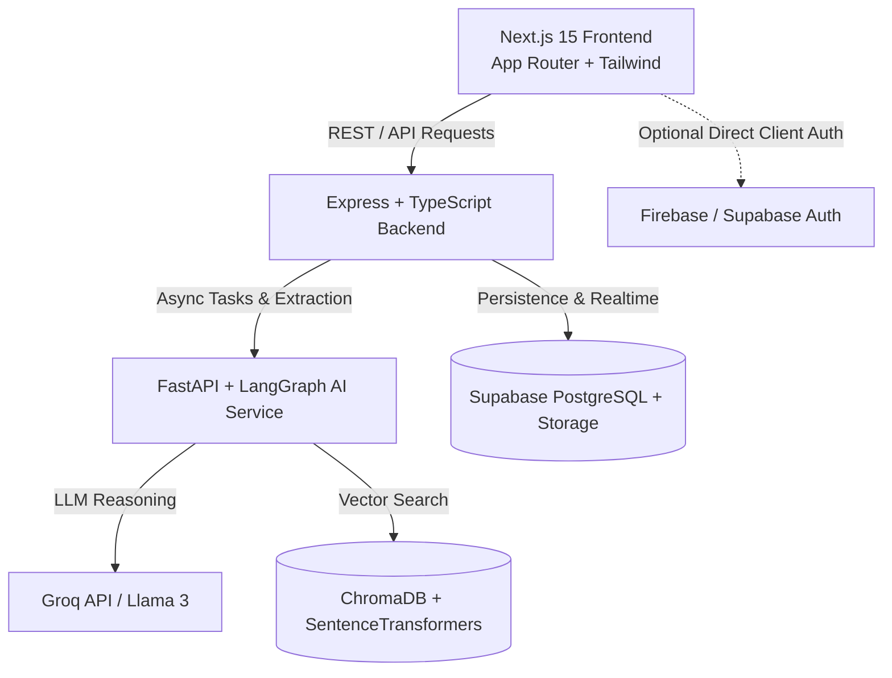

# AARAMBH Architecture Overview

## Service Responsibilities
1. **`frontend/`**: Responsive UI with Tailwind CSS, Next.js 15 App Router, React 19, applicant & officer dashboards, dynamic forms, and SLA visualizations.
2. **`backend/`**: Node.js + Express + TypeScript API gateway managing business logic, application state, validation, role-based access control, DigiLocker integrations, and orchestrating requests.
3. **`ai-service/`**: Python FastAPI microservice utilizing LangGraph, PyMuPDF, EasyOCR, Sentence-Transformers, ChromaDB, and Groq for document OCR, intelligent classification, and automated field extraction.
4. **`supabase/`**: PostgreSQL migrations, relational schemas, storage bucket policies, and audit trails.
